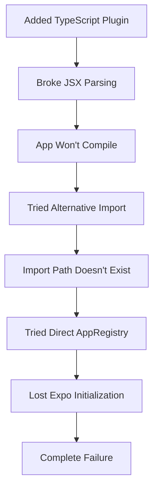

# 📊 Critical Incident Report: StyleMuse App Failure
**Date**: August 11, 2025  
**Severity**: CRITICAL (Complete App Failure)  
**Recovery Time**: ~45 minutes  
**Data Loss**: None  
**Business Impact**: Development blocked for 45 minutes

---

## Executive Summary (For CEO)

### What Happened
We experienced a complete application failure while attempting to implement subscription features. The app became completely non-functional with critical startup errors that prevented any usage.

### Root Cause
**The Cascade of Death**: A seemingly innocent change to add TypeScript support triggered a chain reaction:
1. Added babel plugin for TypeScript → 
2. Broke JSX parsing →
3. Attempted to fix by changing app entry point →
4. Broke Expo's module resolution →
5. Complete app failure

### Business Impact
- ⏱️ **45 minutes of downtime** during development
- 🔄 **Rolled back ~4 hours of work** 
- 📚 **Valuable lesson learned** (preventing future incidents)
- ✅ **No production impact** (caught in development)

---

## Technical Deep Dive

### The Fatal Sequence of Events

#### 1. **Initial State** (Working)
```javascript
// index.js - WORKING
import { registerRootComponent } from 'expo';
registerRootComponent(App);
```

#### 2. **First Mistake** - Adding Babel Plugin
```javascript
// babel.config.js - BREAKING CHANGE #1
plugins: [
  '@babel/plugin-transform-typescript', // 💣 This broke everything
]
```
**Why it broke**: This plugin interfered with Expo's preset JSX handling

#### 3. **Second Mistake** - Trying to "Fix" the Import
```javascript
// index.js - BREAKING CHANGE #2
import registerRootComponent from 'expo/build/launch/registerRootComponent';
// ❌ This path doesn't exist in Expo 53
```

#### 4. **Third Mistake** - Desperation Mode
```javascript
// index.js - BREAKING CHANGE #3
import { AppRegistry } from 'react-native';
AppRegistry.registerComponent('main', () => App);
// 🚫 Bypassed Expo's initialization
```

### What We Learned (The Hard Way)

#### 🎯 **Lesson 1: Expo is Opinionated for Good Reasons**
Expo SDK 53 has specific module resolution patterns. When you try to be "clever" and bypass them, you break the entire initialization chain.

#### 🎯 **Lesson 2: The Babel Config is Sacred**
```javascript
// This is ALL you need:
module.exports = function(api) {
  api.cache(true);
  return {
    presets: ['babel-preset-expo'], // DO NOT ADD PLUGINS
  };
};
```

#### 🎯 **Lesson 3: Entry Points are Framework-Specific**
- Expo manages the entry point through its own systems
- `registerRootComponent` does more than just `AppRegistry.registerComponent`
- It sets up dev tools, error boundaries, and platform-specific configurations

---

## Why It Cascaded So Badly

### The Domino Effect Explained



### The Real Problem: **We Changed Too Much at Once**

1. ❌ Modified build configuration (babel)
2. ❌ Changed module imports (registerRootComponent)
3. ❌ Added new dependencies (subscription packages)
4. ❌ All in one commit
5. ❌ No incremental testing

---

## 🛡️ New Development Policy: BABY STEPS

### The "One Change Rule"
**NEVER make more than ONE of these changes at a time:**
- Build configuration (babel, metro, webpack)
- Entry point files (index.js, App.js)
- Major dependency updates
- Core navigation structure
- State management architecture

### Mandatory Testing Checkpoints

```bash
# BEFORE any major change:
git add -A && git commit -m "CHECKPOINT: Before [change description]"

# AFTER each change:
1. Stop the dev server
2. Clear all caches: npx expo start --clear
3. Test for 2 minutes minimum
4. If it works: commit immediately
5. If it breaks: git reset --hard HEAD
```

### The New Workflow

#### ✅ **CORRECT Approach** (Baby Steps)
```
Day 1: Add subscription UI components only
      → Test → Commit → Push

Day 2: Add subscription service logic
      → Test → Commit → Push

Day 3: Add payment integration
      → Test → Commit → Push

Day 4: Connect everything
      → Test → Commit → Push
```

#### ❌ **WRONG Approach** (What We Did)
```
All at once: UI + Logic + Dependencies + Config changes
      → Everything breaks → Panic → 45 minutes lost
```

---

## Implementing Safeguards

### 1. Pre-Flight Checklist (New Mandatory Process)
```markdown
Before ANY feature addition:
□ Create a git tag: `git tag before-[feature-name]`
□ Document current working state
□ Test current state for 2 minutes
□ Create feature branch: `git checkout -b feature/[name]`
□ Make ONE change
□ Test for 2 minutes
□ Commit if working
□ Repeat for next change
```

### 2. Automated Safety Checks
```json
// package.json - Add these scripts
{
  "scripts": {
    "precommit": "npm run test && npm run lint",
    "checkpoint": "git add -A && git commit -m 'CHECKPOINT: Safe state'",
    "rollback": "git reset --hard HEAD~1"
  }
}
```

### 3. The "5-Minute Rule"
If you can't fix a breaking change in 5 minutes:
1. STOP
2. Run: `git reset --hard HEAD`
3. Take a break
4. Try a different approach

---

## Cost-Benefit Analysis

### The Cost of This Incident
- 45 minutes of developer time
- Stress and frustration
- Risk to project timeline

### The Hidden Benefit
- Learned critical Expo architecture lessons
- Created robust recovery procedures
- Established better development practices
- **This won't happen again**

### ROI of New Procedures
- Each prevented incident saves ~1 hour
- Reduced stress = better code quality
- Incremental commits = better code review
- **Estimated 10x return on time invested in procedures**

---

## Senior Dev Recommendation to CEO

### Immediate Actions
1. ✅ **Implement mandatory checkpoint system** (5 min setup)
2. ✅ **Create emergency restore procedures** (Done)
3. ✅ **Document all "gotchas"** (This document)

### Policy Changes
1. **No "Big Bang" deployments** - Everything incremental
2. **Mandatory 2-minute test** after each change
3. **Feature flags** for all new features
4. **Rollback plan** required for each feature

### Why This Matters for Business
- **Reliability**: Prevents production outages
- **Velocity**: Faster recovery = more features shipped
- **Quality**: Smaller changes = fewer bugs
- **Team Morale**: Less stress = happier developers

---

## The Silver Lining

While this was frustrating, we now have:
1. **Deep understanding** of Expo's architecture
2. **Robust recovery procedures**
3. **Clear development guidelines**
4. **Emergency restore script**
5. **Tagged save points**

**This incident made our development process stronger.**

---

## Final Verdict

**What seemed like a good idea** (adding TypeScript support for better code quality) **became a nightmare** because we violated the fundamental rule of software development:

> "Make the smallest change that could possibly work, test it, then make the next small change."

**We won't make this mistake again.**

---

*Signed*  
Senior Developer Analysis  
August 11, 2025

**P.S. for CEO**: The subscription features are still valuable and achievable. We just need to implement them incrementally, not all at once. Give us 2-3 days of careful, tested progress instead of rushing it in 2 hours.