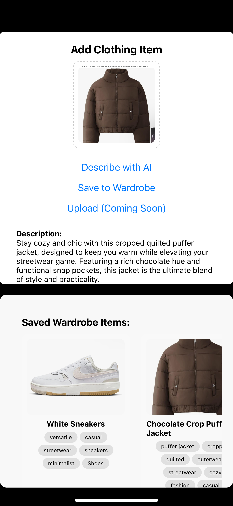

# 👗 StyleMuse

**StyleMuse** is your AI-powered mobile wardrobe — a personal styling assistant that lets you upload clothing, generate fashion titles and descriptions, edit tags, and build a digital closet you control. Powered by GPT-4o Vision and your own creativity.

---

## ✨ Features

* 📸 **Wardrobe Upload**
  Snap or upload photos of your clothes to digitize your closet.

* 🧠 **AI-Powered Styling**
  StyleMuse uses GPT-4o to generate catchy fashion titles, catalog-style descriptions, and smart fashion tags for each item.

* ✏️ **Editable Titles & Tags**
  Refine AI results by editing clothing titles and managing your own tags directly from the item modal.

* 🖼️ **Horizontal Gallery View**
  Scroll through your wardrobe with tappable preview cards showing titles, images, and tags.

* 🔍 **Detail Modal View**
  Tap any item to open it full-screen, edit metadata, or delete it. Swipe down to close.

---

## 🛠 Tech Stack

* **React Native** (with Expo)
* **OpenAI GPT-4o (Vision + Chat)**
* **Styled Components**
* **Firebase** *(coming soon)*

---

## 🚧 Coming Soon

* 🏷️ Tag-based filtering and search
* 🧠 GPT-based full outfit generation
* 📅 Outfit planner
* 🧑‍🤝‍🧑 Outfit sharing & social wardrobe sync
* 🌐 Cloud save with Firebase

---

## 🛠 Setup Instructions

```bash
git clone https://github.com/yourusername/stylemuse.git
cd stylemuse
npm install
npx expo start
```

> You'll need an OpenAI API key to enable AI-powered styling and image analysis.

---

## 📸 Demo


*A preview of AI-generated titles, image tagging, and a scrollable wardrobe UI.*

---

## 🙌 Contributing

Got feature ideas, tag logic improvements, or UI suggestions? PRs and issues welcome!

---

## 🧵 Created by Kaiya Kramer

Crafted with style, vision, and the belief that AI can make fashion more personal and fun.
