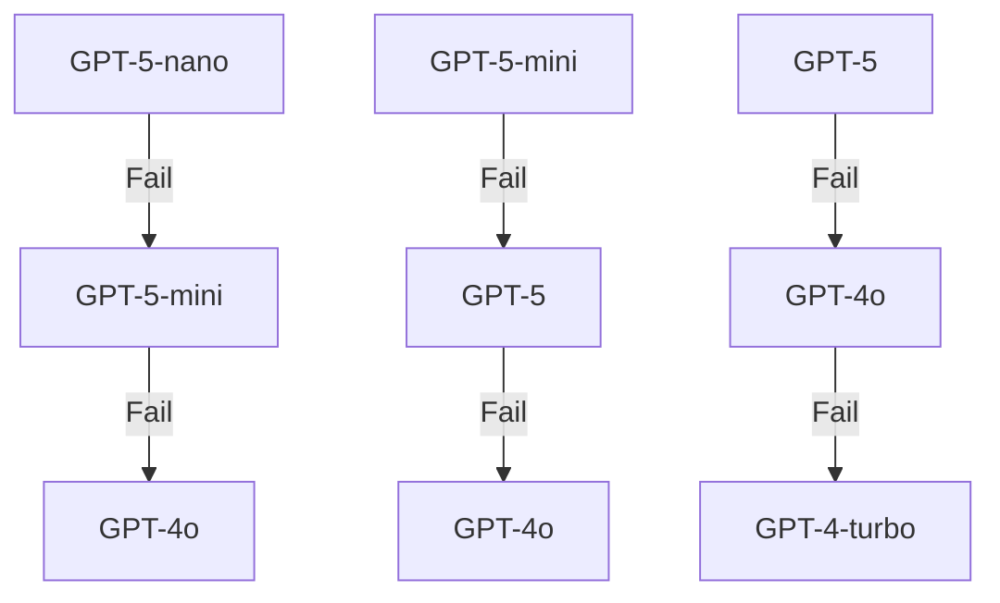

# AI Model Routing Decision Tree

## Overview
StyleMuse implements an intelligent AI model routing system that optimizes for cost, performance, and reliability by selecting the appropriate GPT-5 family model based on task complexity.

## Model Family Specifications

### GPT-5 Series Capabilities

| Model | Cost/1K tokens | Reasoning | Creativity | Speed | Best For |
|-------|---------------|-----------|------------|-------|----------|
| **GPT-5** | $0.06 | 100% | 100% | 60% | Complex analysis, structured outputs, ranking |
| **GPT-5-mini** | $0.012 | 80% | 85% | 85% | Standard outfit generation, weather context |
| **GPT-5-nano** | $0.003 | 60% | 65% | 95% | Tags, colors, simple validation |

## Routing Decision Tree

```yaml
AI_MODEL_ROUTER:
  TASK_ANALYSIS:
    - Evaluate task complexity
    - Check structured output requirements
    - Assess context window needs
    - Consider user tier restrictions
    
  SIMPLE_TASKS: # GPT-5-nano
    tag_generation:
      requirements: { reasoning: 30%, creativity: 40% }
      example: "Extract color tags from item description"
      
    color_extraction:
      requirements: { reasoning: 20%, creativity: 10% }
      example: "Identify primary and secondary colors"
      
    simple_validation:
      requirements: { reasoning: 40%, creativity: 10% }
      example: "Validate if outfit matches occasion"
      
    short_copy:
      requirements: { reasoning: 30%, creativity: 60% }
      example: "Generate 1-line outfit description"
      
  STANDARD_TASKS: # GPT-5-mini
    outfit_generation:
      requirements: { reasoning: 70%, creativity: 80% }
      example: "Create complete outfit from wardrobe"
      
    weather_context:
      requirements: { reasoning: 60%, creativity: 50% }
      example: "Adjust outfit for weather conditions"
      
    style_matching:
      requirements: { reasoning: 65%, creativity: 70% }
      example: "Match items by style compatibility"
      
    item_description:
      requirements: { reasoning: 60%, creativity: 60% }
      example: "Describe clothing item in detail"
      
  COMPLEX_TASKS: # GPT-5
    wardrobe_analysis:
      requirements: { reasoning: 90%, creativity: 85%, structured_output: true }
      example: "Analyze entire wardrobe for gaps and patterns"
      
    structured_json:
      requirements: { reasoning: 85%, creativity: 40%, structured_output: true }
      example: "Generate complex outfit plan JSON"
      
    multi_item_detection:
      requirements: { reasoning: 85%, creativity: 30% }
      example: "Detect and bound multiple items in photo"
      
    style_dna_analysis:
      requirements: { reasoning: 95%, creativity: 90% }
      example: "Deep personal style analysis"
      
    ranking_evaluation:
      requirements: { reasoning: 90%, creativity: 70% }
      example: "Rank and evaluate multiple outfit options"
```

## Cost Optimization Strategies

### Aggressive Mode
- **Priority**: Cost savings
- **Routing**: Nano → Mini → GPT-5
- **Use Case**: Free tier users, high-volume operations
- **Trade-off**: May sacrifice quality for cost

### Balanced Mode (Default)
- **Priority**: Cost-quality balance
- **Routing**: Task-appropriate selection
- **Use Case**: Plus tier users, standard operations
- **Trade-off**: Optimal for most scenarios

### Quality Mode
- **Priority**: Best possible results
- **Routing**: GPT-5 → Mini → Nano
- **Use Case**: Premium users, critical operations
- **Trade-off**: Higher cost for superior results

## Fallback Chains



## Parallel Processing Workflow

### Example: Weather + Event Outfit Generation

```typescript
// Step 1: Generate 3 outfit options with Mini
const outfitPrompts = [
  { prompt: casualPrompt, model: AIModel.GPT5_MINI, taskClass: TaskClass.OUTFIT_GENERATION },
  { prompt: smartCasualPrompt, model: AIModel.GPT5_MINI, taskClass: TaskClass.OUTFIT_GENERATION },
  { prompt: businessPrompt, model: AIModel.GPT5_MINI, taskClass: TaskClass.OUTFIT_GENERATION }
];

// Step 2: Rank with GPT-5
const rankingPrompt = {
  prompt: rankOutfitsPrompt,
  model: AIModel.GPT5,
  taskClass: TaskClass.RANKING_EVALUATION
};

// Step 3: Execute in parallel
const results = await aiRouter.executeParallel([...outfitPrompts, rankingPrompt], executor);
```

## User Tier Restrictions

| Tier | Available Models | Daily Limits | Parallel Processing |
|------|-----------------|--------------|-------------------|
| **Free** | GPT-5-nano, GPT-3.5 | 100 requests | Disabled |
| **Plus** | All GPT-5 family, GPT-4o | 1000 requests | 3 concurrent |
| **Premium** | All models, priority queue | Unlimited | 10 concurrent |

## Performance Metrics Tracking

### Key Metrics
- **Cost per request**: Track spending by model and task
- **Latency**: Monitor response times
- **Success rate**: Track reliability by model
- **Token usage**: Optimize prompt lengths

### Analytics Dashboard
```typescript
const analytics = aiRouter.getAnalytics();
// Returns:
{
  totalCost: 1.234,
  byModel: {
    'gpt-5-nano': { cost: 0.123, count: 100, successRate: 0.95 },
    'gpt-5-mini': { cost: 0.456, count: 50, successRate: 0.92 },
    'gpt-5': { cost: 0.655, count: 10, successRate: 0.98 }
  },
  byTask: {
    'outfit_generation': { cost: 0.5, count: 40, avgLatency: 2500 },
    'tag_generation': { cost: 0.1, count: 80, avgLatency: 500 }
  },
  recommendations: [
    "Task 'wardrobe_analysis' has high avg cost. Consider using lighter models.",
    "Consider reducing usage of gpt-4o (78.5% success rate)"
  ]
}
```

## Implementation Examples

### Basic Usage
```typescript
import { aiRouter, TaskClass, AIModel } from '../services/aiRouter';

// Auto-select model based on task
const model = aiRouter.selectModel(TaskClass.OUTFIT_GENERATION, {
  userTier: 'plus',
  contextSize: 4000
});

// Execute with fallbacks
const result = await executeWithFallbacks(prompt, model);
```

### Debug Override
```typescript
// Force specific model for testing
aiRouter.configure({
  forceModel: AIModel.GPT5_NANO,
  enableFallbacks: false
});
```

### Cost Optimization
```typescript
// Configure for aggressive cost savings
aiRouter.configure({
  costOptimization: 'aggressive',
  maxCostPerRequest: 0.01
});
```

## Model Evaluation Agent Workflow

The Model Evaluation Agent periodically benchmarks model performance:

1. **Sample Selection**: Randomly selects prompts from each task class
2. **Parallel Execution**: Runs same prompt on multiple models
3. **Quality Scoring**: Evaluates outputs for:
   - Accuracy and completeness
   - Style diversity
   - Logical consistency
   - User preference alignment
4. **Performance Analysis**: Updates routing preferences based on results
5. **Cost-Benefit Report**: Generates recommendations for model selection

## Best Practices

1. **Start Small**: Use nano for initial validation, upgrade if needed
2. **Batch Similar Tasks**: Group nano tasks for efficiency
3. **Monitor Metrics**: Review analytics weekly to optimize routing
4. **User Feedback Loop**: Track user satisfaction by model selection
5. **Graceful Degradation**: Always have fallback options configured

## Future Enhancements

- **Dynamic Pricing**: Adjust routing based on real-time pricing
- **ML-based Routing**: Learn optimal routing from historical data
- **Custom Models**: Support for fine-tuned variants
- **Regional Optimization**: Route based on datacenter proximity
- **Caching Layer**: Intelligent response caching by task similarity